Auteur : Heinz Thierry

Version : 0.0.2

Date : 06/08/2026

# **Documentation et rapport du projet MDD**

## **Sommaire**

1. Présentation générale du projet
   1.1 Objectifs du projet
   1.2 Périmètre fonctionnel
2. Architecture et conception technique
   2.1 Schéma global de l'architecture
   2.2 Choix techniques
   2.3 API (Server Actions) et schémas de données
3. Tests, performance et qualité
   3.1 Stratégie de test
   3.2 Rapport de performance et optimisation
   3.3 Revue technique
4. Documentation utilisateur et supervision
   4.1 FAQ utilisateur
   4.2 Supervision et tâches déléguées à l'IA
5. **Annexes**

---

## **1\. Présentation générale du projet**

### **1.1 Objectifs du projet**

Orion, société spécialisée dans le développement logiciel, développe MDD (Monde de Dév), un réseau social destiné aux développeurs, avec pour objectif la mise en relation entre pairs et la recherche d'emploi. Pour Orion, l'intérêt est de constituer un vivier de recrutement pour ses prochains projets. Le projet correspond à un MVP (Minimum Viable Product), destiné à être testé en interne.

Principales fonctionnalités : authentification, création de compte, lecture d'articles, écriture de commentaires, publication d'articles, abonnement à des thèmes, modification de profil.

### **1.2 Périmètre fonctionnel**

| Fonctionnalités                      | Description                                                                                      | Statut   |
| :----------------------------------- | :----------------------------------------------------------------------------------------------- | :------- |
| **Authentification (connexion)**     | Formulaire de connexion par e-mail ou nom d'utilisateur + mot de passe, sécurisé via Better-Auth | Terminée |
| **Création d'un compte utilisateur** | Formulaire et validation d'inscription (Zod) : nom d'utilisateur, e-mail, mot de passe           | Terminée |
| **Publication d'un article**         | Création d'un article associé à un thème, via Server Actions                                     | Terminée |
| **Commentaires**                     | Ajout de commentaires sur un article, associés à un auteur                                       | Terminée |
| **Abonnement à des thèmes**          | S'abonner / se désabonner à des thèmes de programmation                                          | Terminée |
| **Gestion du profil**                | Modification du nom d'utilisateur, de l'e-mail et du mot de passe                                | Terminée |

---

## **2\. Architecture et conception technique**

### **2.1 Schéma global de l'architecture**

L'architecture s'organise en couches, toutes colocalisées dans le projet Next.js (framework full-stack), sans API REST séparée : **Composants Client** (orange), **Server Actions** (bleu), **Service + Repository** (vert), **Prisma ORM** (violet) et **base de données** PostgreSQL (rouge).

Entités de la base de données (PK = clé primaire, FK = clé étrangère) : `SUBSCRIPTION` est une table de jonction entre `User` et `Topic` ; `VERIFICATION`, `ACCOUNT` et `SESSION` sont des tables requises par la librairie Better-Auth pour l'authentification ; `_prisma_migrations` est générée par Prisma pour le suivi des migrations. Schéma détaillé des entités : voir §5.3.

### **2.2 Choix techniques**

| Éléments choisis             | Type                         | Lien documentation                                           | Objectif du choix                                 | Justification                                                                               |
| :--------------------------- | :--------------------------- | :----------------------------------------------------------- | :------------------------------------------------ | :------------------------------------------------------------------------------------------ |
| TypeScript 5                 | Langage                      | [docs](https://www.typescriptlang.org/docs)                  | Typage statique de bout en bout                   | Fiabilité, autocomplétion, moins d'erreurs en production                                    |
| Next.js 16                   | Framework full-stack         | [docs](https://nextjs.org/docs)                              | Architecture unifiée et Server Components         | Performance, SEO et simplification de la stack (pas d'API REST séparée)                     |
| PostgreSQL                   | Base de données              | [docs](https://www.postgresql.org/docs/current/)             | Sauvegarde des données                            | Base de données SQL open-source                                                             |
| Prisma                       | ORM                          | [docs](https://www.prisma.io/docs)                           | Accès typé à la base de données PostgreSQL        | Client TypeScript généré à partir du schéma, migrations versionnées                         |
| Better-Auth                  | Librairie d'authentification | [docs](https://better-auth.com/docs/introduction)            | Sécurisation de l'application                     | Librairie open-source recommandée et activement maintenue                                   |
| Zod                          | Librairie de validation      | [docs](https://zod.dev)                                      | Validation des formulaires et des entrées serveur | Schémas réutilisables, types TypeScript inférés automatiquement                             |
| Tailwind CSS 4               | Librairie de style           | [docs](https://tailwindcss.com/docs/installation/using-vite) | Gestion des styles                                | Librairie de style recommandée                                                              |
| Shadcn/ui                    | Librairie UI                 | [docs](https://ui.shadcn.com/docs/installation)              | Librairie de composants                           | Librairie de composants UI active                                                           |
| Jest + React Testing Library | Test unitaire et intégration | [docs](https://jestjs.io/fr/docs/getting-started)            | Test unitaire et d'intégration                    | Intégration native avec Next.js via next/jest, écosystème mature avec React Testing Library |
| Playwright                   | Test e2e                     | [docs](https://playwright.dev/docs/intro)                    | Test E2E                                          | Standard de l'industrie                                                                     |
| @axe-core/playwright         | Test d'accessibilité         | [docs](https://github.com/dequelabs/axe-core-npm)            | Détection des violations WCAG                     | Intégration native avec Playwright, standard de l'industrie                                 |

### **2.3 API et schémas de données**

| Server Action / Endpoint            | Type     | Description                                                                             | Retour / Réponse                                                                   |
| :---------------------------------- | :------- | :-------------------------------------------------------------------------------------- | :--------------------------------------------------------------------------------- |
| login                               | Mutation | Authentifie un utilisateur (e-mail ou nom d'utilisateur + mot de passe) via Better-Auth | `ActionResult` : session + redirection vers `/dashboard`, ou message d'erreur      |
| register                            | Mutation | Crée un compte utilisateur et une session                                               | `ActionResult` : redirection vers `/dashboard`, ou erreurs de validation par champ |
| createPost                          | Mutation | Publie un nouvel article associé à un thème                                             | `ActionResult` : redirection vers `/dashboard`                                     |
| createComment                       | Mutation | Ajoute un commentaire à un article                                                      | `ActionResult` : revalidation de la page article                                   |
| subscribeAction / unsubscribeAction | Mutation | Abonne / désabonne l'utilisateur courant à un thème                                     | `ActionResult` : revalidation de `/topics` et `/profile`                           |
| saveProfile                         | Mutation | Met à jour nom d'utilisateur, e-mail et/ou mot de passe (champs indépendants)           | `ActionResult` : message de succès ou erreurs de validation par champ              |

**Remarque** : les opérations de lecture (liste des articles, détail d'un article, liste des thèmes, profil) ne passent pas par des Server Actions dédiées. Elles sont exécutées directement côté serveur dans les React Server Components via la couche Service (ex. `postService.getPosts()`), ce qui évite un aller-retour réseau supplémentaire.

Toutes les Server Actions suivent le même pipeline : validation Zod → vérification de session (`withAuth`, sauf `login`/`register` qui sont publiques) → Service (règles métier) → Repository (accès Prisma). Les erreurs sont normalisées via `withActionErrorHandling` en un objet `ActionResult<T>` exploité côté client par `useActionState`.

Schéma Prisma (modèles, relations, contraintes) et diagramme ERD : voir §5.3.

---

## **3\. Tests, performance et qualité**

### **3.1 Stratégie de test**

| Type de test                   | Outil / framework            | Portée                                                                                                                                | Résultats                                                                                                  |
| :----------------------------- | :--------------------------- | :------------------------------------------------------------------------------------------------------------------------------------ | :--------------------------------------------------------------------------------------------------------- |
| Test unitaire et d'intégration | Jest + React Testing Library | Composants UI (`components/`) et logique métier (`features/` : actions, services)                                                     | 160/160 tests passent (27 suites) — couverture 100 % (instructions, fonctions, lignes), 99,51 % (branches) |
| Test end-to-end                | Playwright (Chromium)        | Parcours critiques : inscription/connexion, guards de routes, dashboard, thèmes, articles, commentaires, profil, navigation mobile    | 35/35 tests passent                                                                                        |
| Test d'accessibilité           | @axe-core/playwright         | Pages publiques (`/`, `/login`, `/register`) et authentifiées (`/dashboard`, `/topics`, `/profile`, `/post/create`, détail d'article) | Intégré à la suite e2e — 0 violation détectée                                                              |

Les tests e2e s'exécutent contre une base PostgreSQL dédiée (`mdd_e2e_db`, port 5433), entièrement réinitialisée et re-seedée avant chaque run, isolée de la base de développement (`mdd_db`, port 5432).

### **3.2 Rapport de performance et optimisation**

Audits Lighthouse (build de production) :

| Page                              | Performance | Accessibilité | Bonnes pratiques |
| :-------------------------------- | :---------- | :------------ | :--------------- |
| Accueil (`/`)                     | 94          | 100           | 100              |
| Connexion (`/login`)              | 96          | 100           | 100              |
| Inscription (`/register`)         | 96          | 100           | 100              |
| Dashboard (`/dashboard`)          | 96          | 100           | 100              |
| Topics (`/topics`)                | 96          | 100           | 100              |
| Profil (`/profile`)               | 96          | 100           | 100              |
| Créer un article (`/post/create`) | 97          | 100           | 100              |
| Détail d'un article (`/post/1`)   | 96          | 100           | 100              |

Suite aux audits Lighthouse, `fetchPriority="high"` et `priority` ont été ajoutés sur le logo de la page d'accueil pour améliorer le LCP.

### **3.3 Revue technique**

- **Point fort :** pipeline standardisé (se rapprochant des principes SOLID, validation Zod → session → Service → Repository), schéma Zod partagé comme source de vérité unique, usage des atouts de Next.js (App Router, RSC, Server Actions).
- **À améliorer :** performance et audits, messages d'erreur à traduire.
- **Action corrective :** amélioration du LCP, traduction des messages d'erreur (hors librairies tierces).
- **Pistes d'évolution :** réinitialisation de mot de passe, messages d'erreur Better-Auth non traduits, absence de design system.

---

## **4\. Documentation utilisateur et supervision**

### **4.1 FAQ utilisateur**

**Général**

Q : Qu'est-ce que MDD (Monde de Dév) ?
R : Un réseau social destiné aux développeurs, permettant de s'abonner à des thèmes de programmation, de publier des articles et d'échanger via des commentaires.

**Compte et connexion**

Q : Comment créer un compte ou me connecter ?
R : Depuis la page d'accueil, "S'inscrire" ouvre un formulaire (nom d'utilisateur, e-mail, mot de passe) et vous connecte automatiquement ; "Se connecter" accepte un e-mail ou un nom d'utilisateur, puis le mot de passe. En cas d'identifiants refusés, un message d'erreur s'affiche au-dessus du formulaire. La déconnexion se fait via la barre de navigation (menu hamburger sur mobile).

**Profil**

Q : Comment modifier mon nom d'utilisateur, mon e-mail ou mon mot de passe ?
R : Depuis la page "Profil", le formulaire pré-rempli permet de modifier chaque champ indépendamment ; seuls les champs modifiés sont pris en compte, et un message confirme l'enregistrement.

**Thèmes**

Q : Comment m'abonner ou me désabonner d'un thème ?
R : Depuis la page "Thèmes", chaque thème affiche un bouton "S'abonner" / "Déjà abonné" (qui désabonne au clic) ; la liste des abonnements est aussi visible et modifiable depuis la page "Profil".

**Articles**

Q : Comment publier, trier ou lire un article ?
R : "Créer un article" permet de choisir un thème, un titre et un contenu ; le fil d'articles peut être trié par date (bouton "Trier par") ; cliquer sur le titre d'un article ouvre sa page dédiée avec son contenu et ses commentaires.

**Commentaires**

Q : Comment ajouter un commentaire à un article ?
R : Sur la page d'un article, saisissez votre message (3 caractères minimum) puis validez ; il apparaît immédiatement dans la liste.

**Navigation mobile**

Q : Comment naviguer sur mobile ou tablette ?
R : Une icône "hamburger" ouvre un panneau latéral donnant accès à la déconnexion, aux articles, aux thèmes et au profil.

**Problèmes courants**

Q : Un message d'erreur s'affiche en anglais, ou le fil d'articles semble vide, est-ce normal ?
R : Certains messages de validation ne sont pas encore traduits en français (cela n'affecte pas le fonctionnement) ; un fil vide signifie généralement qu'aucun article ne correspond encore à vos abonnements — essayez d'en créer un ou de vérifier vos abonnements aux thèmes.

### **4.2 Supervision et tâches déléguées à l'IA**

| Tâche déléguée                                  | Outil / collaborateur | Objectif                                                   | Vérification effectuée                                                                       |
| :---------------------------------------------- | :-------------------- | :--------------------------------------------------------- | :------------------------------------------------------------------------------------------- |
| Recherche                                       | Claude web            | Identifier les bonnes pratiques et architectures possibles | Confrontation avec une recherche manuelle sur le web, YouTube et la documentation officielle |
| Génération des tests unitaires et d'intégration | Claude Code           | Gain de temps sur la couverture du code                    | Relecture des tests et vérification de la couverture                                         |
| Génération des tests e2e                        | Claude Code           | Gain de temps sur la validation                            | Utilisation de l'UI de Playwright                                                            |
| Génération des commentaires TSDoc               | Claude Code           | Gain de temps sur la documentation                         | Relecture de la documentation statique générée                                               |
| Génération du README.md                         | Claude Code           | Gain de temps sur la documentation                         | Plan, relecture et validation du README.md dans le repo                                      |
| Génération du DOCUMENTATION.md                  | Claude Code           | Gain de temps sur la documentation                         | Plan, relecture et validation du DOCUMENTATION.md dans le repo                               |
| Génération de la FAQ                            | Claude Code           | Gain de temps sur la documentation                         | Plan, relecture et modification de la partie FAQ                                             |

---

## **5\. Annexes**

### **5.1 Captures d'écran de l'UI**

Captures réalisées sur un build de production (Chromium headless, via Playwright), en desktop (1440×900) et mobile (Pixel 5), avec le compte de test e2e (contenu d'exemple : articles et thèmes de test).

| Page                               | Desktop                                                       | Mobile                                                      |
| :--------------------------------- | :------------------------------------------------------------ | :---------------------------------------------------------- |
| Accueil (`/`)                      | 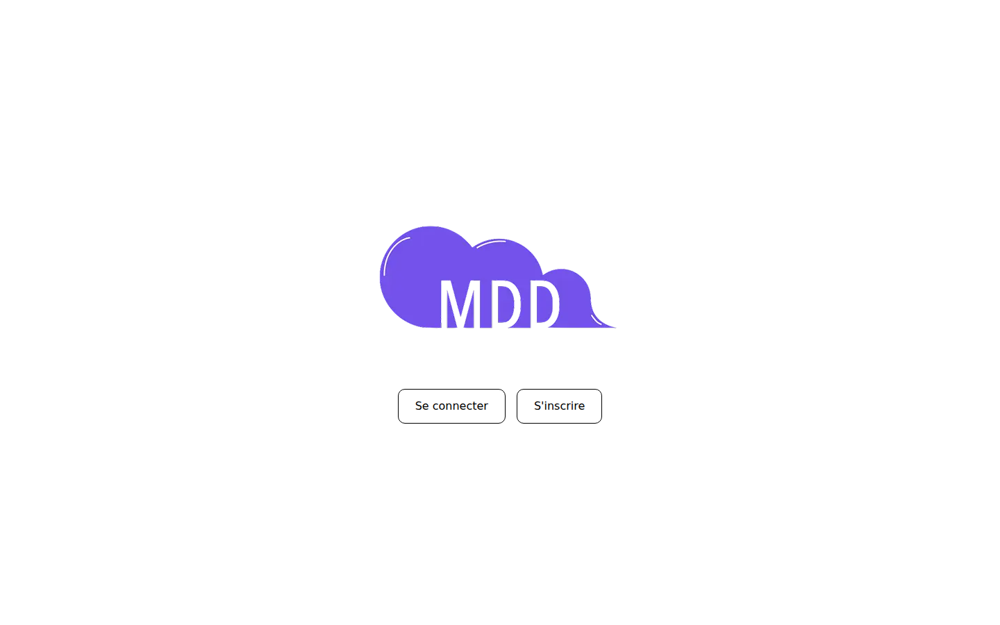      | 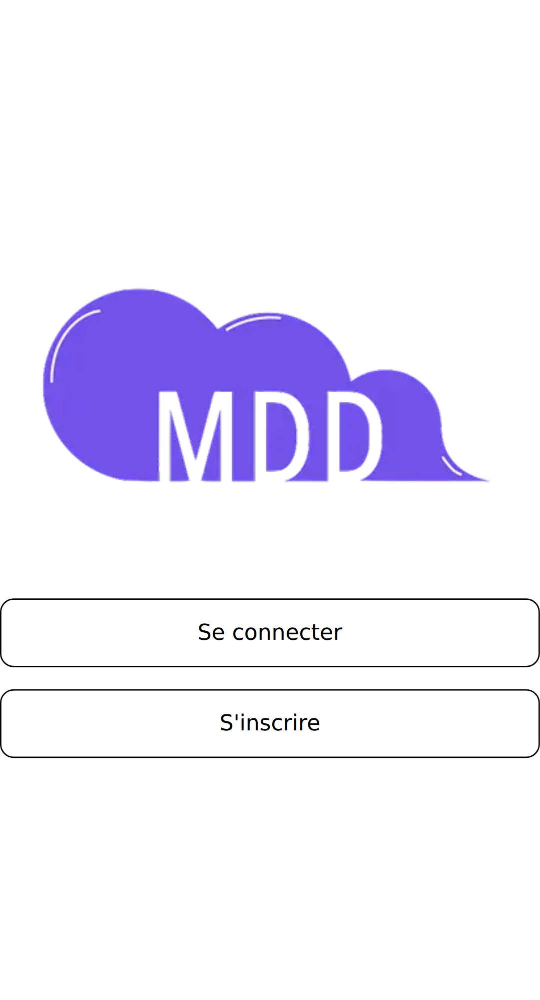      |
| Connexion (`/login`)               | 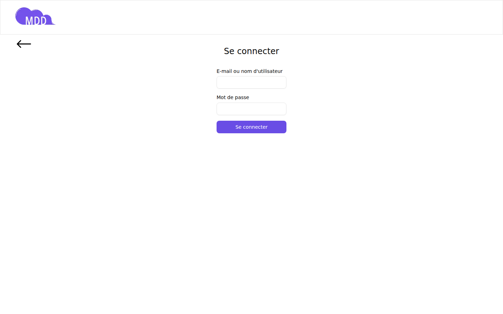      | 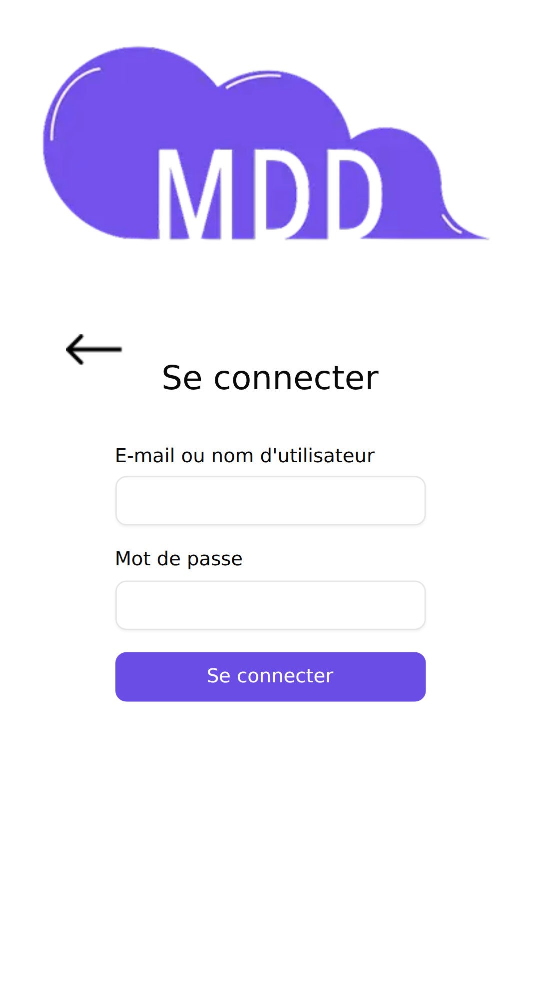      |
| Inscription (`/register`)          | 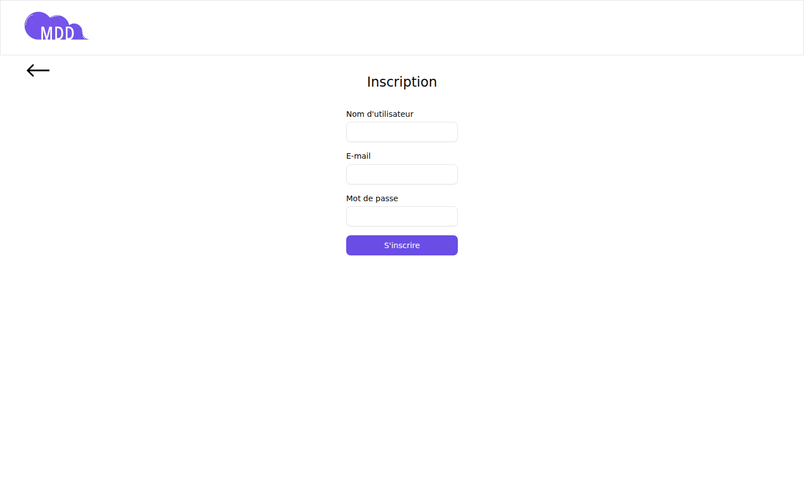 | 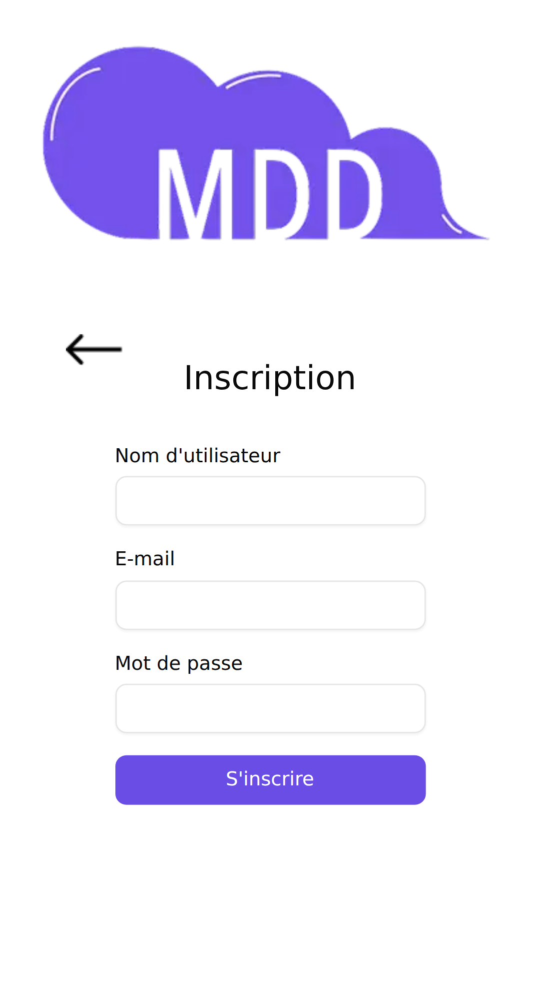 |
| Fil d'articles (`/dashboard`)      | 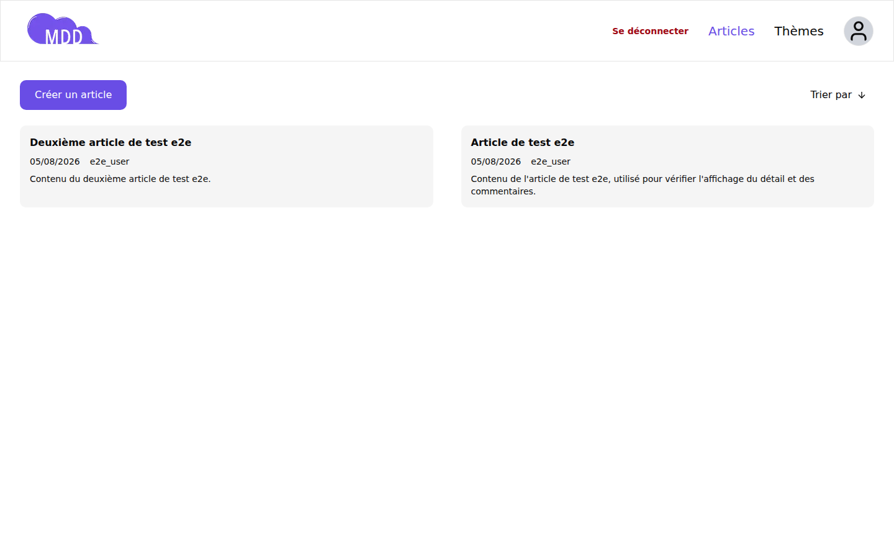  | 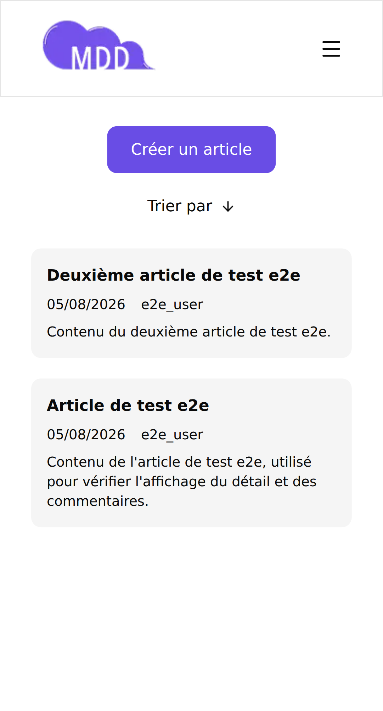  |
| Thèmes (`/topics`)                 | 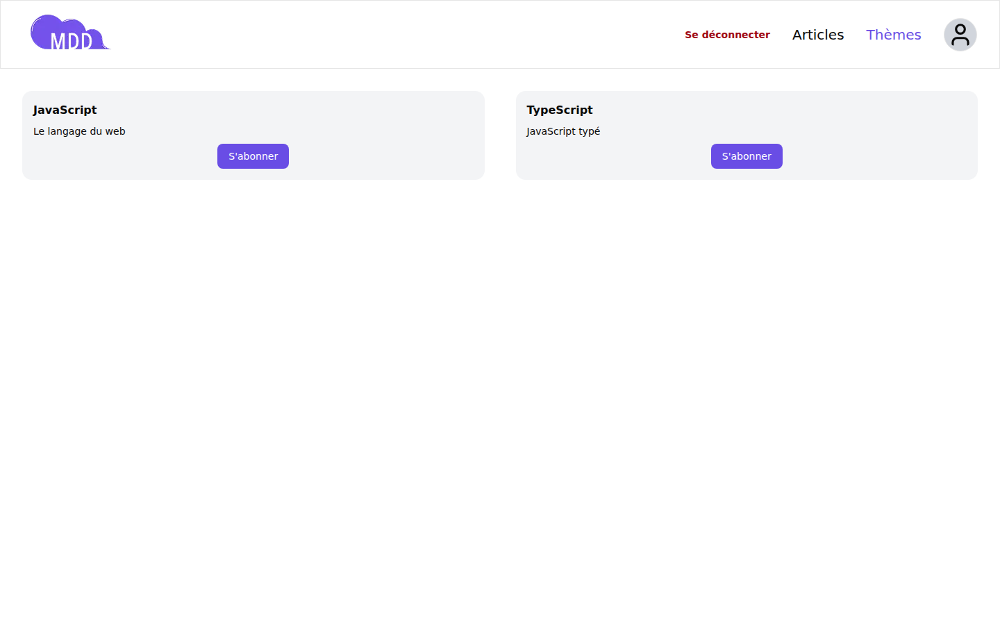        | 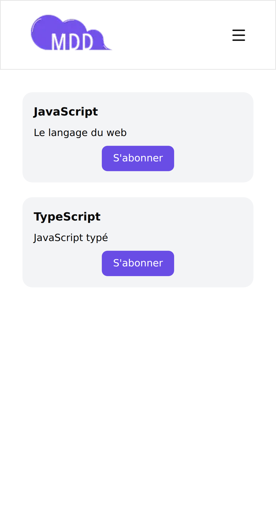        |
| Détail d'un article (`/post/[id]`) | 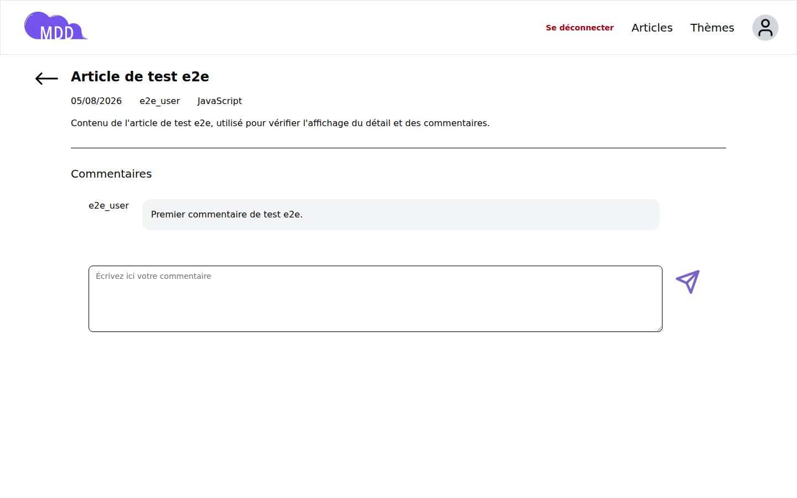  | 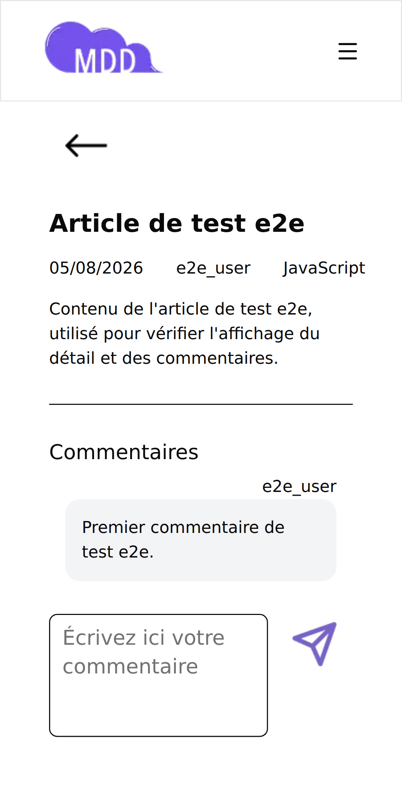  |
| Créer un article (`/post/create`)  | 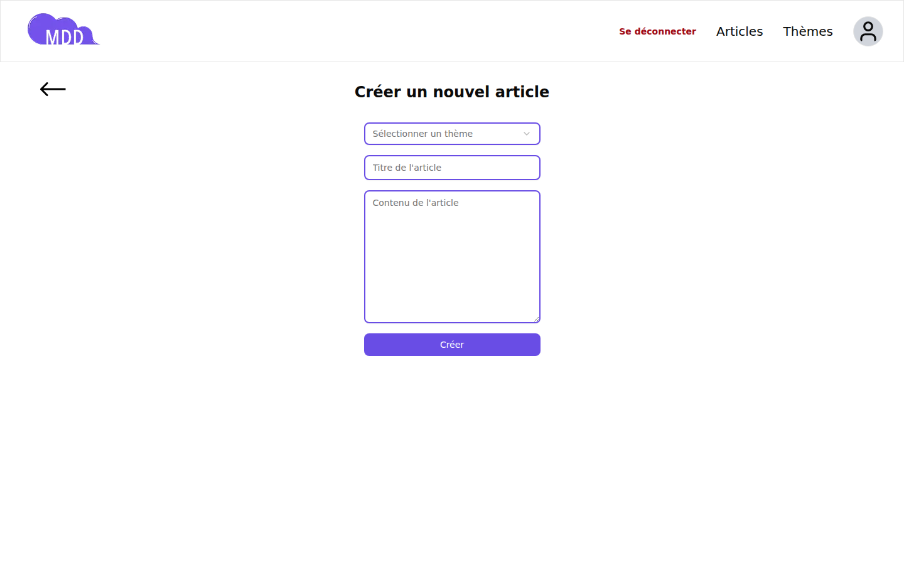 | 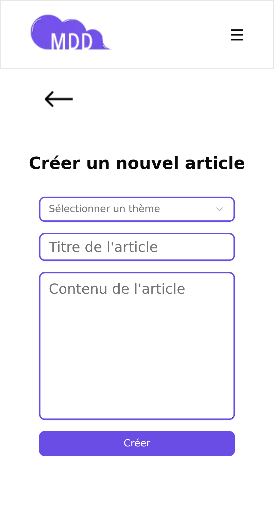 |
| Profil (`/profile`)                | 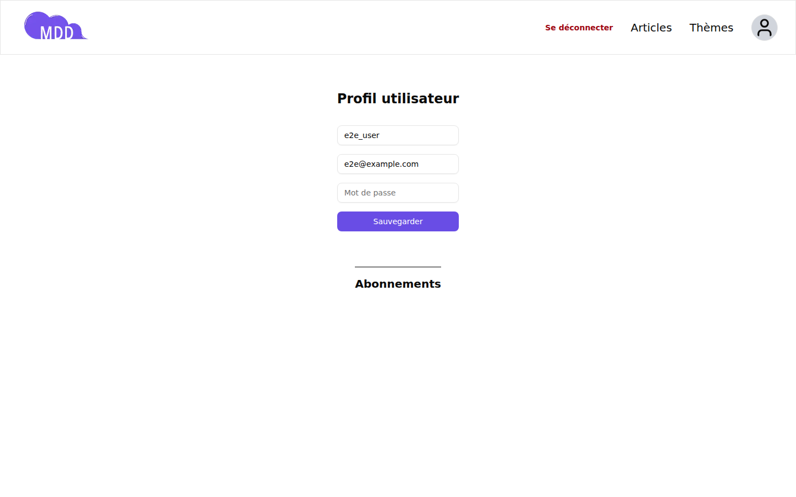       | 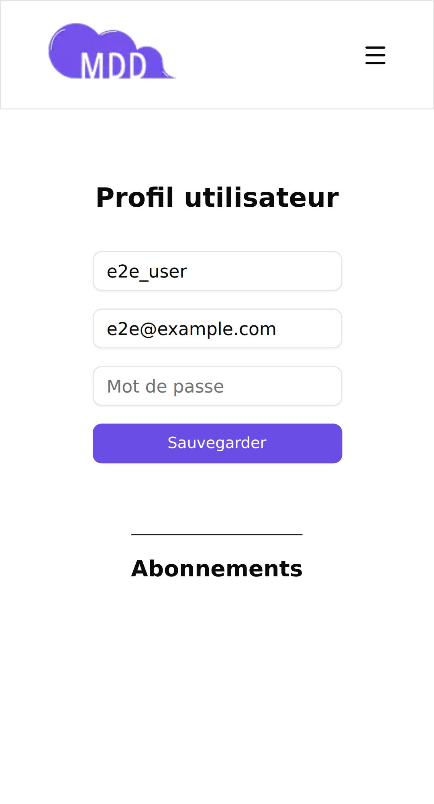       |

### **5.2 Analyse des besoins front-end**

Maquettes de référence (desktop et mobile) : [Figma — Maquettes MDD](https://www.figma.com/design/xYsKMOhvFag9Cfqi4J1KYI/Maquettes-MDD--desktop-et-mobile---Copy-?node-id=0-1).

| Écran maquette                                                | Route implémentée                        | Statut                        |
| :------------------------------------------------------------ | :--------------------------------------- | :---------------------------- |
| Accueil (Se connecter / S'inscrire)                           | `/`                                      | Conforme                      |
| Connexion                                                     | `/login`                                 | Conforme                      |
| Inscription                                                   | `/register`                              | Conforme                      |
| Fil d'articles (tri)                                          | `/dashboard`                             | Conforme                      |
| Détail d'un article + commentaires                            | `/post/[id]`                             | Conforme                      |
| Créer un article                                              | `/post/create`                           | Conforme                      |
| Thèmes (abonnement / désabonnement)                           | `/topics`                                | Conforme                      |
| Profil (identifiants, mot de passe, abonnements, déconnexion) | `/profile`                               | Conforme                      |
| Version mobile (navigation en menu)                           | Toutes les routes (breakpoints Tailwind) | Conforme — voir captures §5.1 |

La maquette impose que chaque écran soit responsive (desktop / tablette / mobile) ; ce point est couvert à la fois par les captures d'écran ci-dessus et par les tests e2e dédiés (`e2e/mobile-nav.spec.ts`, projet Playwright `mobile` sur profil Pixel 5).

### **5.3 Définition des données**

**Modèle de données (Prisma / PostgreSQL)**

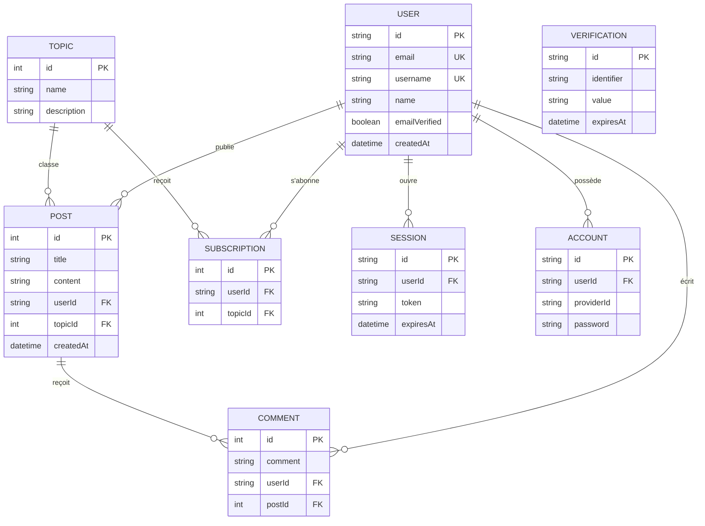

`SUBSCRIPTION` porte une contrainte d'unicité sur `(userId, topicId)`, empêchant qu'un utilisateur s'abonne deux fois au même thème. `SESSION`, `ACCOUNT` et `VERIFICATION` suivent le schéma requis par Better Auth (authentification par session, table dédiée aux comptes/providers) ; `VERIFICATION` n'a pas de relation directe avec `USER` (son champ `identifier` référence librement une valeur à vérifier, ex. une adresse e-mail). Schéma complet : [prisma/schema.prisma](prisma/schema.prisma).

**Règles de validation (Zod)**

| DTO                   | Champ                         | Règle                                               |
| :-------------------- | :---------------------------- | :-------------------------------------------------- |
| `registerSchema`      | `email`                       | Format e-mail valide                                |
|                       | `username`                    | 3 à 30 caractères, lettres/chiffres/`_`/`.`         |
|                       | `password`                    | ≥ 8 caractères, min./maj./chiffre/caractère spécial |
| `loginSchema`         | `identifier`                  | ≥ 3 caractères (e-mail ou nom d'utilisateur)        |
|                       | `password`                    | ≥ 8 caractères                                      |
| `updateProfileSchema` | `username`                    | Mêmes règles que l'inscription                      |
| `setPasswordSchema`   | `newPassword`                 | Mêmes règles de force que l'inscription             |
| `changeEmailSchema`   | `newEmail`                    | Format e-mail valide                                |
| `createPostSchema`    | `topicId`, `title`, `content` | Champs requis                                       |
| `createCommentSchema` | `postId`, `comment`           | `postId` requis, `comment` ≥ 3 caractères           |
| `subscribeSchema`     | `topicId`                     | Entier positif                                      |

Chaque schéma est colocalisé avec sa feature (`features/<domaine>/dto/*.schema.ts`), partagé entre validation client (React Hook Form + `@hookform/resolvers`) et validation serveur (Server Actions), pour une seule source de vérité.

### **5.4 Rapports de couverture et de tests**

**Couverture des tests unitaires/intégration (Jest, `npm run test:coverage`)**

| Métrique   | Résultat          |
| :--------- | :---------------- |
| Statements | 100 % (1276/1276) |
| Branches   | 99,51 % (206/207) |
| Functions  | 100 % (43/43)     |
| Lines      | 100 % (1276/1276) |

Rapport HTML détaillé généré localement dans `coverage/lcov-report/index.html` (non versionné, cf. `.gitignore`).

**Tests end-to-end (Playwright, `npm run test:e2e`)**

| Métrique         | Résultat                                      |
| :--------------- | :-------------------------------------------- |
| Tests exécutés   | 35                                            |
| Réussis          | 35                                            |
| Échoués          | 0                                             |
| Flaky            | 0                                             |
| Durée totale     | ~34 s                                         |
| Projets couverts | `setup`, `no-auth`, `authenticated`, `mobile` |

Périmètre : authentification, guards de routes protégées, dashboard, articles, profil, thèmes/abonnements, navigation mobile, accessibilité (pages publiques et authentifiées). Rapport HTML détaillé généré localement dans `playwright-report/index.html` (non versionné).

### **5.5 Rapport de revue technique**

Voir la version complète en **section 3.3 — Revue technique**.
